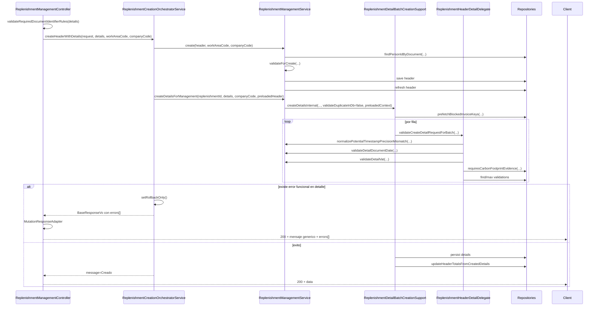

# Backend Reposiciones - Flujo Detallado POST /replenishment-management

## 1. Objetivo

Documentar con detalle tecnico el endpoint principal:

- Metodo: `POST`
- Ruta: `/gtfReplacementsServices/api/v1/replenishment-management`
- Caso de uso: creacion conjunta de cabecera + detalles en una sola transaccion

Este documento aterriza:

- flujo real por capas y metodos
- parametros y semantica
- validaciones y mensajes exactos
- entidades y tablas involucradas
- puntos de optimizacion sin cambiar reglas de negocio

## 2. Resumen Ejecutivo del Flujo

1. Controller recibe `ReplenishmentVo` (cabecera + `details`) y valida reglas condicionales de identificadores de documento.
2. Orquestador transaccional crea cabecera (`create`) y luego detalles batch (`createDetailsForManagement`).
3. Si una fila de detalle falla validacion funcional, se marca `rollbackOnly` y no queda cabecera persistida.
4. La respuesta se adapta con mensaje generico de mutacion cuando hay error funcional.

## 3. Secuencia End-to-End

## 4. Metodos Clave y Responsabilidad

### 4.1 Controller

Clase: `ReplenishmentManagementController`

Metodo de entrada:

- `create(@Valid @RequestBody @NotNull ReplenishmentVo request)`

Responsabilidad:

- valida identificadores condicionales por fila (`taxId`/`documentNumber`) con `ReplenishmentManagementRequestValidationSupport`
- obtiene contexto de usuario (`workAreaCode`, `companyID`) desde Keycloak
- invoca orquestador
- adapta respuesta con `MutationResponseAdapter` para contrato uniforme de mutaciones

### 4.2 Orquestador transaccional

Clase: `ReplenishmentCreationOrchestratorService`

Metodo:

- `createHeaderWithDetails(ReplenishmentVo replenishmentVo, List<ReplenishmentDetailVo> replenishmentDetailVos, Integer workAreaCode, Integer companyCode)`

Responsabilidad:

- orquesta create de cabecera y create de detalle en una sola transaccion
- controla rollback funcional si falla detalle
- propaga `errors[]` funcionales de detalle
- emite trazas de performance por etapa (`headerCreateMs`, `detailCreateMs`, `totalMs`)

### 4.3 Servicio de management (cabecera)

Clase: `ReplenishmentManagementService`

Metodo de cabecera usado en este endpoint:

- `create(ReplenishmentVo replenishmentVo, Integer workAreaCode, Integer companyCode, IReplenishmentHeaderPersistenceDelegate persistenceGateway)`

Reglas internas relevantes:

- fuerza `replenishmentId = null` para evitar updates accidentales en POST create
- fuerza `transactionCode = "1"`
- limpia `responsiblePersonId` y resuelve siempre por `responsiblePersonDocument`
- valida cabecera con `ReplenishmentHeaderValidatorSupport.validateForCreate(...)`
- persiste con `ReplenishmentHeaderPersistenceSupport.save(...)`

### 4.4 Servicio de management (detalle batch)

Metodo llamado por el orquestador:

- `createDetailsForManagement(replenishmentId, details, companyCode, preloadedReplenishmentContext)`

Significado de parametros en esta llamada:

- `replenishmentId`: id de cabecera ya creada en el paso anterior.
- `details`: arreglo de filas de detalle a validar y persistir.
- `companyCode`: compania del usuario autenticado (token).
- `preloadedReplenishmentContext`: cabecera recien creada (objeto en memoria) para no volver a consultarla en BD.

Por que se mantiene `replenishmentId` aunque exista `preloadedReplenishmentContext`:

- el batch soporta dos modos: con cabecera precargada y sin cabecera precargada; por eso el id sigue siendo parte del contrato base.
- `preloadedReplenishmentContext` es una optimizacion de lectura (contexto), mientras `replenishmentId` es la llave canonica para operaciones de persistencia y consultas de detalle.
- en este flujo el id se usa directamente para guardar filas (`buildDetailEntity`), asignar `replenishmentId` en la respuesta y actualizar totales de cabecera; tambien se usa para excluir la misma reposicion en validaciones de reuso bloqueado.
- cuando no hay contexto suficiente en `preloadedReplenishmentContext`, el flujo hace fallback de carga usando `replenishmentId`.

Delega en:

- `ReplenishmentDetailBatchCreationSupport.createDetailsInternal(...)`

Con parametros efectivos para este endpoint:

- `validateDuplicateDocumentsAgainstDatabase = false`
- `preloadedReplenishmentContext = createdHeader`

Interpretacion funcional de esos dos parametros:

- `validateDuplicateDocumentsAgainstDatabase = false`: en este endpoint no se ejecuta la validacion de duplicado simple contra BD en el lote; se valida duplicado dentro del mismo request y las reglas de contexto bloqueado.
- `preloadedReplenishmentContext = createdHeader`: el batch usa la cabecera ya creada por el orquestador para ahorrar una lectura adicional de cabecera.

### 4.5 Batch support de detalle

Clase: `ReplenishmentDetailBatchCreationSupport`

Responsabilidad:

- prevalidacion del lote
- prefetch de llaves bloqueadas para evitar consultas repetidas por fila
- validacion fila a fila
- asignacion de IDs de detalle
- persistencia de detalles
- actualizacion de totales de cabecera por incremento

Que significa "actualizacion de totales de cabecera por incremento":

- en lugar de recalcular todo desde cero cada vez, se suma el delta de las filas nuevas (`requestedValue` e `vatValue`) a los totales actuales de cabecera.
- si falta contexto base o el update directo no afecta filas, el flujo hace fallback a recálculo completo.

## 5. Parametros del Endpoint y Semantica

## 5.1 Cabecera (`ReplenishmentVo`)

| Campo                       | Requerido en este flujo      | Uso real en create                             | Observaciones                                  |
| --------------------------- | ---------------------------- | ---------------------------------------------- | ---------------------------------------------- |
| `workAreaCode`              | Si                           | Se reemplaza con `workAreaCode` de token       | Si llega distinto en body, prevalece token     |
| `responsiblePersonDocument` | Si (regla operativa vigente) | Se usa para resolver `responsiblePersonId`     | Si no existe persona, falla                    |
| `responsiblePersonId`       | No (interno)                 | Se limpia al inicio y se resuelve internamente | Front no debe depender de este campo en create |
| `transactionCode`           | No (interno)                 | Se fuerza a `"1"`                              | Front no debe depender de este campo en create |
| `observation`               | Si                           | Validado y persistido                          | Obligatorio                                    |
| `advanceValue`              | No                           | Persistido si llega                            | Opcional                                       |
| `beneficiaryPersonId`       | No                           | No es requisito en transaccion `1`             | Opcional                                       |
| `checkResponsiblePersonId`  | No                           | Si llega se valida existencia                  | Opcional                                       |
| `startDate`                 | No                           | Validacion de rango si llega con `endDate`     | Opcional                                       |
| `endDate`                   | No                           | Validacion de rango si llega con `startDate`   | Opcional                                       |
| `details`                   | Si                           | Se usa en etapa de detalle                     | Debe traer al menos 1 fila                     |

## 5.2 Detalle (`ReplenishmentDetailVo`) por fila

| Campo                                                       | Requerido   | Validacion                                      |
| ----------------------------------------------------------- | ----------- | ----------------------------------------------- |
| `billingConceptSequence`                                    | Si          | Requerido en create detalle                     |
| `documentType`                                              | Si          | Requerido + reglas condicionales                |
| `documentDate`                                              | Si          | Requerido + no futura                           |
| `requestedValue`                                            | Si          | Requerido + reglas de monto maximo              |
| `vatValue`                                                  | Si          | Requerido + coherencia IVA                      |
| `taxId`                                                     | Condicional | Obligatorio para tipos FAC/FEL/RET\*            |
| `documentNumber`                                            | Condicional | Obligatorio para tipos FAC/FEL/RET\*            |
| `fileName`                                                  | Condicional | Obligatorio si concepto exige huella de carbono |
| Otros campos (`saleReceipt`, `accessKey`, `quantity`, etc.) | No          | Se persisten si llegan                          |

## 6. Matriz de Validaciones (Orden Real)

## 6.1 Antes de entrar al servicio

1. `@Valid` sobre `ReplenishmentVo` y `List<@Valid ReplenishmentDetailVo>`
2. `ReplenishmentManagementRequestValidationSupport.validateRequiredDocumentIdentifierRules(details)`

Si falla aqui:

- respuesta `400 Bad Request`
- body con `errors[]` desde `ReplenishmentManagementValidationExceptionHandler`

## 6.2 Validacion de cabecera (`create`)

Orden de validacion:

1. request nulo -> `La cabecera de reposicion es requerida.`
2. resolucion por documento:

- `findPersonIdByDocument(responsiblePersonDocument)`
- si no existe -> `No existe una persona con el numero de cedula enviado.`

3. validacion de campos requeridos de entrada:

- `workAreaCode`
- `observation`
- `responsiblePersonDocument` (regla operativa vigente)

4. validaciones internas derivadas del flujo:

- `transactionCode` soportado (se aplica siempre, aunque el servicio lo fuerza a `"1"`)
- `responsiblePersonId` resuelto internamente desde `responsiblePersonDocument`

5. validacion de existencia:

- area de trabajo
- persona responsable
- responsable de cheque (si aplica)

6. validacion de rango de fechas (`startDate <= endDate`)
7. regla pendiente por area (solo transaccion `1`)

## 6.3 Prevalidacion de lote detalle (contexto precargado)

En este endpoint (preloaded):

- valida solo que `details` no venga nulo/vacio
- no vuelve a validar `status` ni `transactionCode` porque el flujo viene de create exitoso

## 6.4 Validacion por fila de detalle

Orden de evaluacion por fila:

1. requeridos minimos de detalle
2. normalizacion `taxId/documentNumber`
3. duplicado dentro del mismo request (set en memoria)
4. duplicado en base (deshabilitado en este endpoint)
5. reglas de negocio:

- normalizacion timestamp potencialmente mal serializado
- fecha de documento no futura
- validacion IVA
- archivo obligatorio por huella de carbono (solo para conceptos configurados con exigencia documental)
- maximo por documento (solo cuando el fondo del local tiene configurado `maxDocumentValue` y aplica para transaccion `1`)

6. bloqueo por reuso de factura/retencion en contexto incompatible (evita reutilizar documentos en otra area o en reposicion no pendiente)

Si falla cualquier fila:

- se agrega error: `Fila N: <mensaje>`
- no se persiste ningun detalle

## 7. Mensajes Exactos Relevantes

## 7.1 Mensajes de cabecera

- `La cabecera de reposicion es requerida.`
- `El campo workAreaCode es obligatorio para guardar la reposicion.`
- `El campo observation es obligatorio para guardar la reposicion.`
- `El campo responsiblePersonId o responsiblePersonDocument es obligatorio para crear la reposicion.`
- `No existe una persona con el numero de cedula enviado.`
- `El responsiblePersonId enviado no existe.`
- `El checkResponsiblePersonId enviado no existe.`
- `La fecha de inicio no puede ser mayor que la fecha fin.`
- `El campo transactionCode enviado no es valido. Use 1 para Caja Chica.`
- `El workAreaCode enviado no existe o no pertenece a la compania.`
- `Ya existe una reposicion pendiente para el local.`

## 7.2 Mensajes de detalle

- `Debe enviar al menos un detalle para registrar.`
- `La carga de detalles presenta errores de validacion.`
- `El detalle de reposicion es requerido.`
- `El campo billingConceptSequence es obligatorio para crear el detalle.`
- `El campo documentType es obligatorio para crear el detalle.`
- `La fecha del documento es requerida.`
- `El campo RUC es obligatorio para el tipo de documento seleccionado.`
- `El campo Número de documento es obligatorio para el tipo de documento seleccionado.`
- `La fecha del documento no puede ser mayor a la fecha actual.`
- `El valor del detalle es requerido.`
- `El valor del iva es requerido.`
- `El valor del iva no puede ser negativo.`
- `El valor del iva no puede ser mayor o igual al total.`
- `El iva ingresado es mayor al calculado. Por favor revise y vuelva a ingresarlo.`
- `El detalle que se va a ingresar ya se encuentra ingresado, verifique por favor.`
- `El valor del detalle no puede superar el valor maximo por documento (%.2f).`
- `El campo archivo es obligatorio.`
- `El documento ya se encuentra asociado a una reposicion no pendiente o de otra area de trabajo.`
- `El documento ingresado (%s) ya se encuentra registrado en la fecha: %s, en el local: %s con numero de reposicion %s que se encuentra en estado %s.`

## 7.3 Mensajes de salida del endpoint

- Exito final: `Creado`
- Error funcional adaptado: `No se pudo completar la creacion. Revise los errores reportados.`

Nota:

- Cuando falla detalle, el orquestador puede generar mensaje interno especifico (`La carga de detalles presenta errores de validacion.`), pero el controller lo adapta al mensaje generico de create y conserva `errors[]`.

## 8. Entidades y Tablas Involucradas

## 8.1 Cabecera

Entidad: `ReplenishmentEntity`

- Tabla: `SFGTFTSOLICITUDREPOSICION`
- PK: `CODIGOCOMPANIA + CODIGOREPOSICION`
- Campos claves del flujo:
- `CODIGOAREATRABAJO`
- `CODIGOPERSONARESPONSABLE`
- `CODIGOTRANSACCION`
- `CODCATVALESTSOL`
- `VALORTOTAL`
- `VALORSUBTOTAL`
- `TOTALIVA`
- `ESTADOSOLICITUD`

## 8.2 Detalle

Entidad: `ReplenishmentDetailEntity`

- Tabla: `SFGTFTDETALLEREPOSICION`
- PK: `CODIGOCOMPANIA + CODIGOREPOSICION + SECUENCIALDETALLE`
- Campos claves del flujo:
- `SECCONARETRA` (concepto)
- `NUMERORUCFACTURA`
- `NUMERODOCUMENTO`
- `FECHACONCEPTO`
- `VALORDETALLEREPOSICION`
- `VALORIVA`
- `CODCATVALDOCTIP`
- `CODCATTIPDOCTIP`
- `ESTADODETALLE`

## 8.3 Catalogos de apoyo

- `PersonEntity` (`SSPCOTPERSONA`) para resolver `responsiblePersonDocument -> responsiblePersonId`
- `WorkAreaFundEntity` (`SFGTFTARETRAFIN`) para reglas de monto maximo/porcentajes de fondo

## 9. Comportamiento Transaccional y Rollback

Clase transaccional: `ReplenishmentCreationOrchestratorService` (`@Transactional`)

Comportamiento:

1. crea cabecera
2. crea lote detalle
3. si detalle falla validacion funcional:

- ejecuta `TransactionAspectSupport.currentTransactionStatus().setRollbackOnly()`
- retorna `BaseResponseVo` con `errors[]`

4. resultado: no quedan cabeceras huerfanas para este endpoint

## 10. Instrumentacion de Performance

Trazas de rendimiento activas por umbral:

- Controller: `Perf POST /replenishment-management totalMs=...`
- Orquestador: `Perf POST /replenishment-management stage=...`
- Batch: `Perf createDetailsInternal outcome=...`
- Repositorio detalle:
- `Perf findBlockedInvoiceDocumentKeys.targeted ...`
- `Perf findBlockedInvoiceDocumentKeys.bulk ...`
- `Perf findMaxDetailId ...`

Estas trazas estan en `WARN` para ser visibles en PRE con `root=WARN`.

## 11. Oportunidades de Optimizacion (sin cambiar reglas)

1. Verificar indices compuestos en detalle para validaciones frecuentes:

- `CODIGOCOMPANIA, NUMERORUCFACTURA, NUMERODOCUMENTO, ESTADODETALLE`
- `CODIGOCOMPANIA, CODIGOREPOSICION, ESTADODETALLE`

2. Monitorear `TARGETED_BLOCKED_KEY_LOOKUP_THRESHOLD` (actual 1) con metricas reales de lote en PRE.
3. Si negocio requiere duplicado contra base en este endpoint, habilitarlo explicitamente y medir impacto antes (hoy va en `false`).
4. Mantener warmup de consultas de create para bajar latencia de primera llamada.

## 12. Checklist Rapido de Diagnostico

Si falla create conjunto:

1. Validar `responsiblePersonDocument` exista en `SSPCOTPERSONA`.
2. Confirmar `details` no vacio.
3. Revisar `errors[]` por fila (`Fila N: ...`) para ubicar regla exacta.
4. Revisar logs `Perf ...` para identificar etapa lenta.
5. Si hay error de auditoria FK en PRE, verificar usuario de auditoria valido (no hardcodear usuarios inexistentes).

---

## Referencias de Codigo

- `gtf-replacements-services/.../controller/replenishmentmanagement/ReplenishmentManagementController`
- `gtf-replacements-core/.../replenishmentmanagement/service/ReplenishmentCreationOrchestratorService`
- `gtf-replacements-core/.../replenishmentmanagement/service/ReplenishmentManagementService`
- `gtf-replacements-core/.../replenishmentmanagement/service/ReplenishmentDetailBatchCreationSupport`
- `gtf-replacements-core/.../replenishment/delegate/ReplenishmentHeaderDetailDelegate`
- `gtf-replacements-core/.../replenishment/delegate/ReplenishmentDetailValidatorDelegate`
- `gtf-replacements-core/.../replenishmentmanagement/service/ReplenishmentHeaderPersistenceSupport`
- `gtf-replacements-client/.../common/GtfReplacementsMessages`
- `gtf-replacements-client/.../common/GtfReplacementsConstants`
